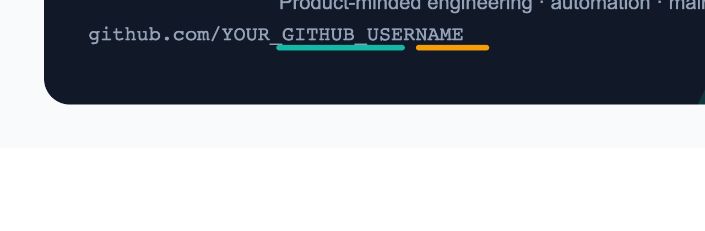
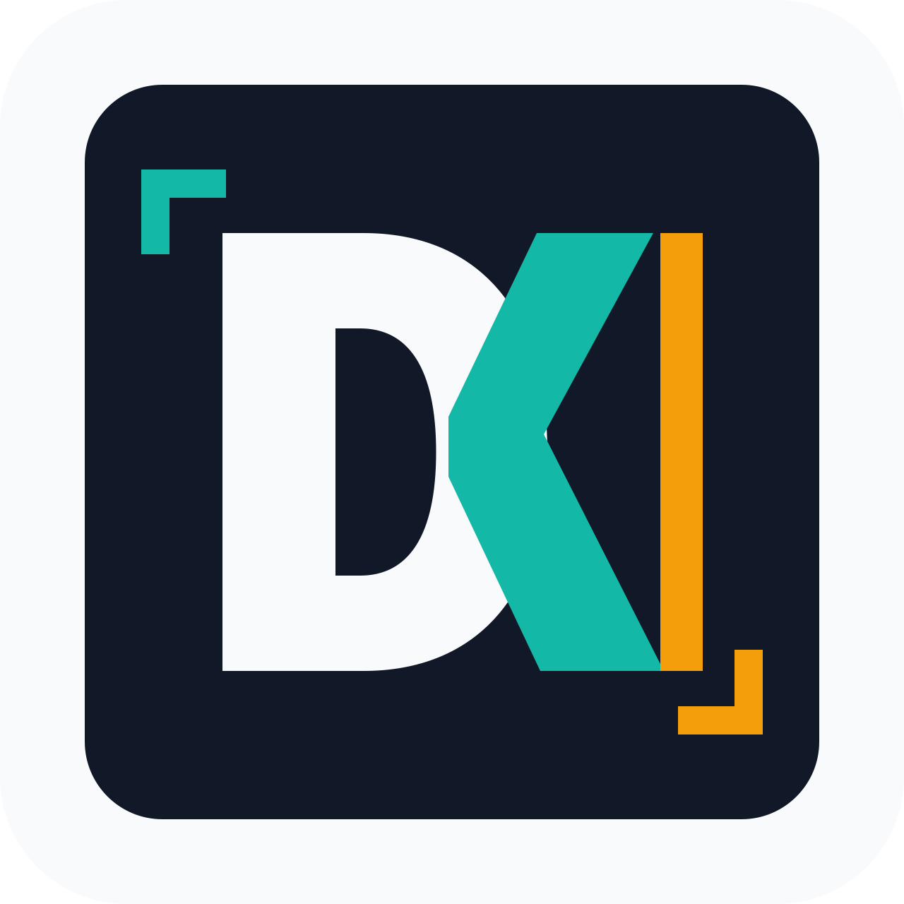

  

  

# David Katjang

I build clear, reliable software with an eye for product detail, automation, and maintainable systems.

Right now I am focused on:

- Shipping useful tools with simple interfaces
- Improving developer workflows and automation
- Building systems that are easy to understand, test, and change

## Selected Work

| Project | What it does | Stack |
| --- | --- | --- |
| [`project-one`](https://github.com/davekatjang/project-one) | Replace with your strongest project and the outcome it creates. | TypeScript, React |
| [`project-two`](https://github.com/davekatjang/project-two) | Replace with a technical project that shows depth. | Python, FastAPI |
| [`project-three`](https://github.com/davekatjang/project-three) | Replace with a practical automation, library, or app. | Node.js |

## How I Work

- Prefer small, understandable systems over clever abstractions
- Make the main workflow fast before polishing edge cases
- Keep docs close to the code
- Use tests where they reduce real risk

## Tools I Reach For

`TypeScript` · `Python` · `React` · `Node.js` · `GitHub Actions` · `PostgreSQL` · `Docker`

## Contact

- GitHub: [`@davekatjang`](https://github.com/davekatjang)
